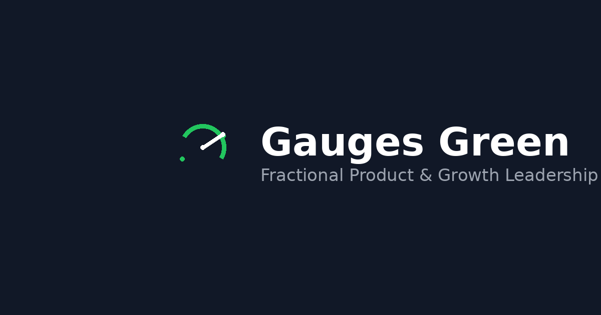

# Astro vCard Template



A premium, high-performance portfolio template built with **Astro 5.0** and **Tailwind CSS**. Designed for developers, designers, and freelancers who want a fast, professional, and easy-to-configure personal website.

## 🎯 Why Use This Template?

In the competitive world of tech, your portfolio is your first impression. This template is engineered to be:

1.  **Blazing Fast**: Built on Astro's "Zero JS by default" architecture, ensuring instant load times and a perfect 100/100 Lighthouse score.
2.  **Developer-First**: No need to wrestle with complex HTML/CSS for content updates. Everything is managed via a single, type-safe configuration file (`src/config.ts`).
3.  **Professional Design**: Clean typography, dark mode support, and subtle animations that scream "premium" without being distracting.

## 💡 Use Cases

This template is perfect for:

*   **Software Developers**: Showcase your GitHub repositories, tech stack, and work experience in a clean, readable format.
*   **Freelancers**: A single-page "digital business card" to share with potential clients.
*   **Designers**: A minimalist canvas to link to your Dribbble/Behance portfolios.
*   **Content Creators**: Link to your social media, YouTube channel, and blog posts.
*   **Students/Graduates**: A professional resume website to stand out in job applications.

## 🚀 Key Features

- **⚡ Zero JS Bundle**: Minimal client-side JavaScript for maximum performance.
- **🛠️ Config-Driven**: Manage all content (Profile, Experience, Projects) from `src/config.ts`.
- **🌙 Dark Mode**: Fully supported with a smooth toggle and persistence.
- **📱 Responsive Design**: Mobile-first approach using Tailwind CSS.
- **🔍 SEO Optimized**: Meta tags, Open Graph, and semantic HTML included out of the box.
- **🎨 Tailwind CSS**: Easy to customize styling and theme.
- **✨ View Transitions**: Smooth navigation and scrolling.

## 📚 Documentation

**Full documentation is available in the `documentation/` folder.**
Open `documentation/index.html` in your browser to read the detailed guide on installation, configuration, and customization.

## ⚡ Quick Start

1.  **Install dependencies:**
    ```bash
    pnpm install
    # or
    npm install
    ```

2.  **Start development server:**
    ```bash
    pnpm dev
    ```

3.  **Build for production:**
    ```bash
    pnpm build
    ```

## 🛠️ Tech Stack

- [Astro](https://astro.build/)
- [Tailwind CSS](https://tailwindcss.com/)
- [Lucide Icons](https://lucide.dev/)
- [TypeScript](https://www.typescriptlang.org/)

## 📄 License

This project is licensed under the MIT License.
